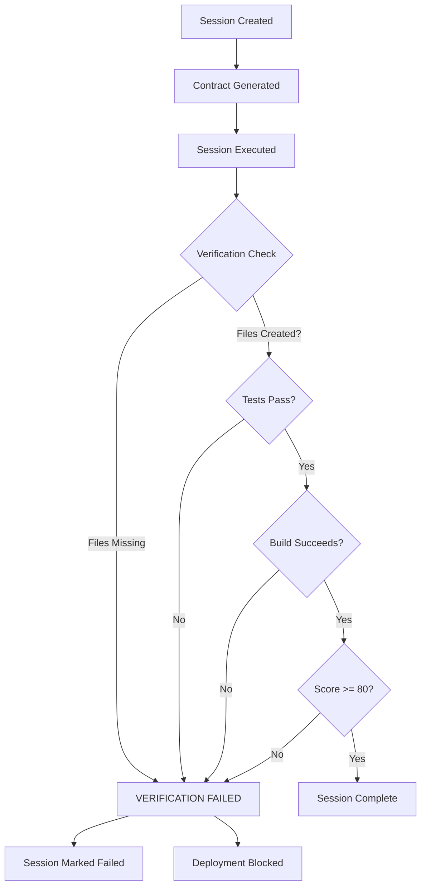

# SessionHub Session Verification Architecture

## The Problem We're Solving

SessionHub's core promise is that users can plan development sessions that will be systematically deployed. However, we discovered the same fundamental flaw that affected our quality gates: **documentation without implementation**.

Just as our quality gates were documented but not enforced, sessions could be marked as "complete" without actually implementing what was promised.

## The Solution: Mandatory Verification System

We've implemented a comprehensive verification system that **prevents sessions from being marked complete unless they actually deliver what was promised**.

## Architecture Components

### 1. SessionVerificationEngine (`src/core/verification/SessionVerificationEngine.ts`)

The core engine that:
- Creates **contracts** for each session BEFORE execution
- Verifies deliverables AFTER execution
- Calculates verification scores
- Maintains audit trails

Key features:
- **Session Contracts**: Immutable records of what a session promises to deliver
- **Evidence Collection**: Automated checking of files, tests, builds
- **Verification Scoring**: 0-100 score based on deliverables, evidence, and criteria
- **Persistent Storage**: Contracts stored in `.sessionhub/contracts/` to prevent tampering

### 2. VerificationGates (`src/core/verification/VerificationGates.ts`)

Enforcement points that block progress without verification:

#### Gate 1: Pre-deployment Gate
```typescript
await verificationGates.preDeploymentGate(sessionId);
// Throws error if session not verified
```

#### Gate 2: Session Completion Gate
```typescript
await verificationGates.sessionCompletionGate(session, verificationResult);
// Blocks marking session as "complete" without verification
```

#### Gate 3: Quality Gate
```typescript
await verificationGates.qualityGate(sessionId, minScore);
// Ensures minimum quality standards (default 80/100)
```

#### Gate 4: Continuous Verification
```typescript
await verificationGates.continuousVerificationGate(sessionIds);
// Periodic re-verification of completed sessions
```

#### Gate 5: Rollback Gate
```typescript
const needsRollback = await verificationGates.rollbackGate(sessionId, deploymentId);
// Triggers rollback if post-deployment verification fails
```

### 3. Integration with SessionManager

The SessionManager now **requires verification** before completing any session:

```typescript
async completeSession(sessionId: string, result: ExecutionResult): Promise<void> {
  // 1. Verify the session delivered what it promised
  const verificationResult = await this.verificationEngine.verifySession(session, result);
  
  // 2. Apply verification gate - throws if verification fails
  await this.verificationGates.sessionCompletionGate(session, verificationResult);
  
  // 3. Only then mark as completed
  await this.updateSession(sessionId, { status: 'completed' });
}
```

## How It Prevents Documentation-Only Sessions

### Example: Session That Only Creates Documentation

```typescript
// Session promises to create authentication system
const instructions = {
  tasks: [
    'Create auth service at src/auth/AuthService.ts',
    'Create login component at src/components/Login.tsx'
  ]
};

// But execution only creates documentation
const result = {
  deliverables: [{
    type: 'documentation',
    path: 'docs/auth-design.md',
    status: 'created'
  }]
};

// Verification FAILS - missing actual code files
// Session CANNOT be marked complete
```

### Example: Session That Actually Implements

```typescript
// Session promises to create user service
const instructions = {
  tasks: ['Create user service at src/services/UserService.ts']
};

// Execution creates the actual file
const result = {
  deliverables: [{
    type: 'code',
    path: 'src/services/UserService.ts',
    status: 'created'
  }]
};

// Verification PASSES - deliverable exists
// Session can be marked complete
```

## Verification Process Flow



## Key Principles

### 1. Contracts Are Immutable
Once a session contract is created, it cannot be modified. This prevents "moving the goalposts" after execution.

### 2. Verification Is Mandatory
You cannot bypass verification. The system will not allow marking a session complete without it.

### 3. Evidence-Based
Verification relies on concrete evidence:
- File existence checks
- Test execution results
- Build success
- Git commit history

### 4. Transparent Reporting
Every verification generates a detailed report showing:
- What was promised
- What was delivered
- What's missing
- Verification score

### 5. Continuous Monitoring
Even after completion, sessions are periodically re-verified to ensure they remain valid.

## Configuration

### Strict Mode (Default: ON)
```typescript
const verificationGates = new VerificationGates(engine, logger, true);
```
- Throws errors on verification failure
- Blocks all progress without verification
- Recommended for production

### Permissive Mode
```typescript
const verificationGates = new VerificationGates(engine, logger, false);
```
- Logs warnings on verification failure
- Allows progress with warnings
- Only for development/debugging

## Monitoring and Alerts

The system provides real-time monitoring:
- Failed verifications trigger immediate alerts
- Verification scores tracked over time
- Trends identify systemic issues

## Testing

Comprehensive test suite ensures:
- Documentation-only sessions are rejected
- Actual implementations are accepted
- All gates function correctly
- Rollback mechanisms work

Run tests:
```bash
npm test src/core/verification/__tests__/SessionVerification.test.ts
```

## Future Enhancements

1. **ML-Based Verification**: Use AI to verify code quality, not just existence
2. **Cross-Session Dependencies**: Verify sessions that depend on each other
3. **Performance Impact Analysis**: Verify sessions don't degrade performance
4. **Security Verification**: Ensure sessions don't introduce vulnerabilities

## Conclusion

This verification system ensures that SessionHub's core promise - planning sessions that are systematically deployed - is actually fulfilled. No more documentation without implementation. Every session must deliver what it promises, or it cannot proceed.

The same rigor we now apply to our own development through quality gates is applied to every session created by SessionHub users.