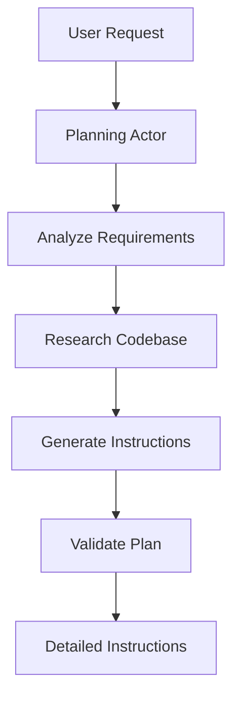

# Understanding the Two-Actor Model

The Two-Actor Model is the revolutionary architecture at the heart of SessionHub, transforming chaotic development into systematic success.

## What is the Two-Actor Model?

The Two-Actor Model separates software development into two distinct phases:

1. **Planning Actor** - The strategist that analyzes and plans
2. **Execution Actor** - The implementer that builds precisely

This separation ensures clarity, precision, and quality in every development task.

## The Planning Actor

### Role and Responsibilities

The Planning Actor is your strategic partner that:
- Analyzes your requirements thoroughly
- Researches the codebase and dependencies
- Creates detailed, step-by-step instructions
- Considers edge cases and error handling
- Ensures architectural consistency

### How Planning Works



### Example Planning Output

When you request: "Add user authentication to my app"

The Planning Actor produces:
```yaml
Session Plan: User Authentication Implementation

1. ANALYZE current architecture
   - Check existing auth setup
   - Identify framework (Next.js detected)
   - Review database schema

2. IMPLEMENT authentication flow
   - Install required packages:
     * next-auth
     * bcryptjs
     * @prisma/client
   
3. CREATE auth components
   - File: /components/auth/LoginForm.tsx
   - File: /components/auth/RegisterForm.tsx
   - File: /pages/api/auth/[...nextauth].ts

4. UPDATE database schema
   - Add User model with fields:
     * id, email, password, createdAt
   
5. CONFIGURE middleware
   - Protect routes requiring authentication
   - Add session management

6. TEST implementation
   - Verify login/logout flow
   - Test protected routes
   - Validate session persistence
```

## The Execution Actor

### Role and Responsibilities

The Execution Actor is your precise implementer that:
- Follows planning instructions exactly
- Writes clean, production-ready code
- Maintains consistency with existing code
- Runs tests and validations
- Reports progress in real-time

### Execution Principles

1. **No Improvisation** - Follows the plan precisely
2. **Quality First** - Ensures code meets all standards
3. **Validation** - Tests each implementation step
4. **Transparency** - Reports every action taken

## Why This Model Works

### 1. Clarity Through Separation

Traditional development mixes thinking and doing, leading to:
- Incomplete analysis
- Ad-hoc solutions
- Technical debt

The Two-Actor Model ensures:
- Complete analysis before coding
- Thoughtful architecture decisions
- Consistent implementation

### 2. Reduced Errors

By planning first:
- Edge cases are considered upfront
- Dependencies are identified early
- Architecture remains consistent
- Testing is built into the plan

### 3. Predictable Outcomes

Clear instructions lead to:
- Consistent code quality
- Predictable timelines
- Reliable results
- Easier debugging

## Best Practices for Two-Actor Success

### Writing Effective Requests

**Good Request:**
```
Create a REST API endpoint for user profiles with:
- GET /api/users/:id - Retrieve user by ID
- PUT /api/users/:id - Update user profile
- Include validation for email and age fields
- Return 404 for non-existent users
- Add rate limiting: 100 requests per hour
```

**Why it works:**
- Specific requirements
- Clear endpoints
- Defined behavior
- Error handling specified

**Poor Request:**
```
Make a user API
```

**Why it fails:**
- Too vague
- No specifications
- Unclear requirements

### Understanding Planning Output

Good plans include:
1. **Context Analysis** - Current state assessment
2. **Clear Steps** - Numbered, specific actions
3. **File Paths** - Exact locations for changes
4. **Code Snippets** - Key implementations
5. **Validation Steps** - How to verify success

### Maximizing Execution Success

1. **Review the Plan** - Ensure it matches your intent
2. **Check Prerequisites** - Verify dependencies exist
3. **Monitor Progress** - Watch real-time updates
4. **Validate Results** - Test the implementation

## Common Patterns

### Feature Development Pattern

```
Planning Phase:
1. Analyze existing code structure
2. Design component architecture
3. Plan state management
4. Define API contracts
5. Specify test scenarios

Execution Phase:
1. Create component files
2. Implement business logic
3. Connect to state/API
4. Write tests
5. Update documentation
```

### Bug Fix Pattern

```
Planning Phase:
1. Reproduce the issue
2. Identify root cause
3. Plan the fix
4. Consider side effects
5. Define test cases

Execution Phase:
1. Implement the fix
2. Add regression tests
3. Verify fix works
4. Check for side effects
```

### Refactoring Pattern

```
Planning Phase:
1. Map current structure
2. Design target structure
3. Plan migration steps
4. Identify test points
5. Plan rollback strategy

Execution Phase:
1. Create new structure
2. Migrate code gradually
3. Run tests at each step
4. Clean up old code
5. Update documentation
```

## Advanced Two-Actor Techniques

### 1. Multi-Session Workflows

Break complex features into multiple sessions:
- Session 1: Database schema and models
- Session 2: API endpoints
- Session 3: Frontend components
- Session 4: Integration and testing

### 2. Iterative Refinement

Use feedback loops:
1. Initial implementation session
2. Testing and bug fix session
3. Performance optimization session
4. Polish and documentation session

### 3. Architecture-First Approach

Start with planning sessions:
- "Plan the architecture for feature X"
- Review and refine the plan
- Execute in subsequent sessions

## Troubleshooting Two-Actor Issues

### Planning Takes Too Long

**Causes:**
- Overly complex request
- Unclear requirements

**Solutions:**
- Break into smaller requests
- Provide more specific details
- Use session templates

### Execution Doesn't Match Plan

**Causes:**
- Plan was ambiguous
- Missing dependencies
- Environment differences

**Solutions:**
- Review plan clarity
- Check prerequisites
- Verify environment setup

### Quality Gate Failures

**Causes:**
- TypeScript errors
- Linting violations
- Test failures

**Solutions:**
- Plan includes type definitions
- Follow project conventions
- Include test updates in plan

## Summary

The Two-Actor Model transforms development by:
- Separating thinking from doing
- Ensuring thorough analysis
- Delivering predictable results
- Maintaining code quality

Master this model, and you'll achieve consistent, high-quality results with every SessionHub session.

## Next Steps

- [Create Your First Session](./first-session.md)
- [Explore Session Templates](../library/templates/README.md)
- [Learn Advanced Workflows](./advanced-workflows.md)